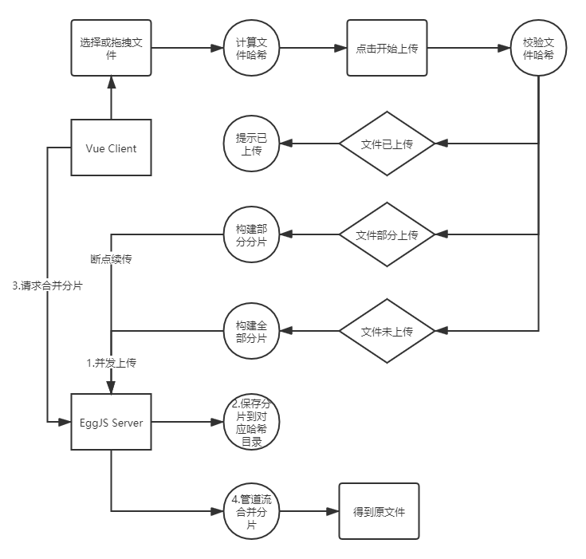
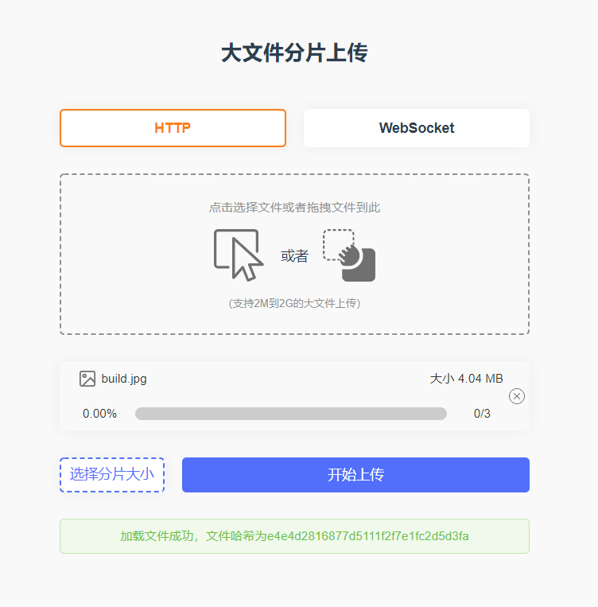
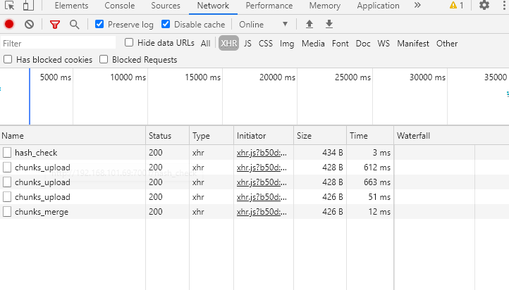
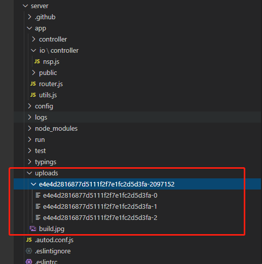
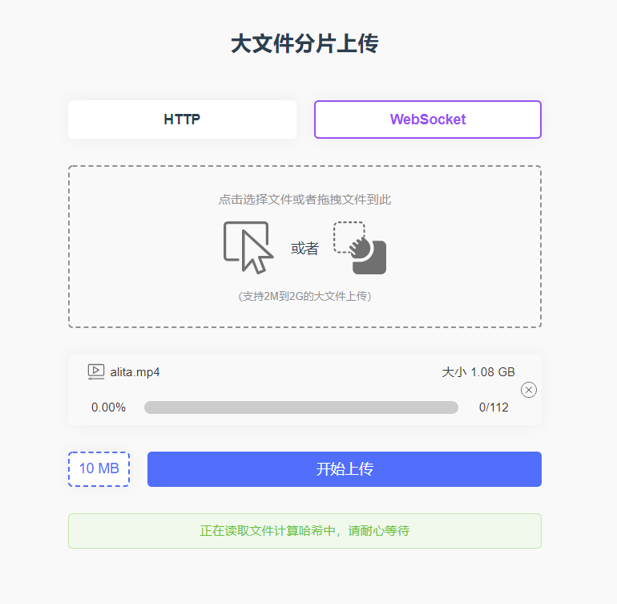
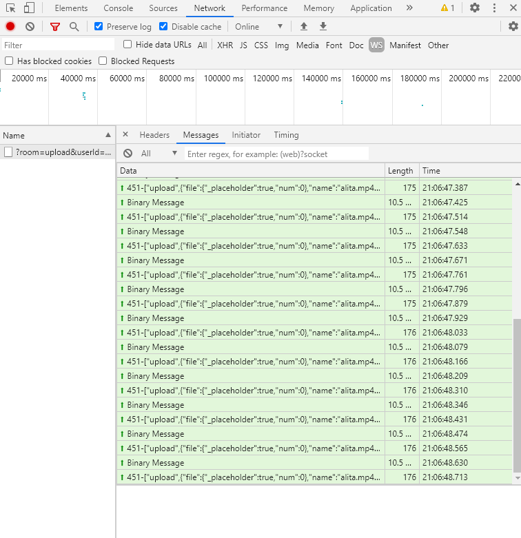
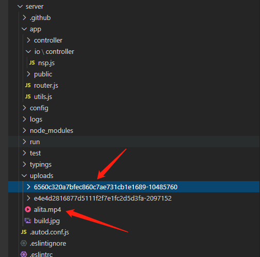

## Nodejs大文件分片上传、断点续传(HTTP/WebSocket)


### 前言

文件上传的场景经常碰到，如果我们上传的文件是一个很大的文件，那么上传的时间应该会比较久，再加上网络不稳定各种因素的影响，很容易导致传输中断，用户除了重新上传文件外没有其他的办法，但是我们可以使用分片上传来解决这个问题。通过分片上传技术，如果网络传输中断，我们重新选择文件只需要传剩余的分片。而不需要重传整个文件，大大减少了重传的开销。

### 项目

#### 分析流程图



* 流程简述

1. 选择或拖拽文件，选择适当的分片大小
2. 生成哈希加密散列
3. 哈希校验（未上传，断点续传，已上传）
4. 选择对应请求协议并发上传
5. 文件分片上传完成，服务器合并分片

#### 项目地址

[https://github.com/xbc30/large-file-upload](https://github.com/xbc30/large-file-upload)

#### 详细目录介绍

```
├─client                       # vue client根目录
│  ├─src                       # 组件根目录
│    ├─assets                  # 静态文件svg
│    ├─components              # 组件目录
│      ├─upload.vue            # 上传组件
│    ├─App.vue                 # 根组件
├─server                       # eggjs server根目录
│  ├─app                       # 请求处理目录
│    ├─controller              # controller目录
│      ├─home.js               # 请求处理controller
│    ├─io                      # io目录
│      ├─controller            # io/controller目录
│        ├─nsp.js              # io请求处理controller
│    ├─router.js               # 路由
│    ├─utils.js                # 工具类函数
│  ├─config                    # 配置
│  ├─uploads                   # 上传文件目录
│    ├─e4e4-2097152            # 上传文件对应哈希目录
|    |—build.jpg               # 最终合并文件
├─README.md                    # README
```

#### 亮点

* HTTP/WebSocket协议可供选择
* 选择或拖拽文件，并显示文件具体信息
* 进度条显示实时进度，友好的操作提示信息
* 根据文件大小自动匹配合适的分片大小，也可自定义分片大小
* 支持断点续传
* 少于等于10个分片请求就执行并行上传，大于10个分片请求就执行顺序同步上传
* 管道流合并分片减轻服务器压力

### 基本知识点

#### 浏览器对象

##### [Blob](https://developer.mozilla.org/zh-CN/docs/Web/API/Blob)

将读取的文件进行分片切割，以拼凑准备上传的数据对象

```javascript
const blobSlice =
  File.prototype.slice || File.prototype.mozSlice || File.prototype.webkitSlice;

blobSlice.call(file, start, end) // 赋值到FormData示例的file属性
```

##### [FileReader](https://developer.mozilla.org/zh-CN/docs/Web/API/FileReader)

使用```FileReader.readAsArrayBuffer()```读取分片内容，以计算文件哈希

```javascript
fileReader.readAsArrayBuffer(blobSlice.call(file, start, end));
// readAsArrayBuffer() 方法用于启动读取指定的 Blob 或 File 内容
```

#### NodeJS模块

##### [fs](http://nodejs.cn/api/fs.html)

```fs```负责读取文件路径，检索文件数量，创建可读流，可写流

##### [stream](http://nodejs.cn/api/stream.html#stream_stream)

管道流的```stream```使用少量内存处理多个文件分片的合并

* highWaterMark  
默认是16kb，调整为每个分片大小的值，使得合并过程中数据不会丢失或损坏，充当缓存池

* pipe  
[数据流中的积压问题](https://nodejs.org/zh-cn/docs/guides/backpressuring-in-streams/)

```javascript
const input = fs.createReadStream(path, {
    highWaterMark: chunkSize
});
input.pipe(output);
```

### 具体开发流程

#### 哈希生成与校验

```Blob```负责将文件按分片大小切分，```FileReader```会按字节读取文件内容，并转换为```ArrayBuffer```对象(二进制缓冲区)，```SparkMD5```负责计算文件最终哈希

```javascript
// 计算文件哈希
calFileHash(file) {
    return new Promise((resolve, reject) => {
        const chunks = Math.ceil(file.size / this.chunkSize);

        const spark = new SparkMD5.ArrayBuffer();
        const fileReader = new FileReader();
        const that = this;
        let currentChunk = 0;

        fileReader.onload = function (e) {
            console.log("read chunk nr", currentChunk + 1, "of", chunks);
            spark.append(e.target.result); // Append array buffer
            currentChunk++;

            if (currentChunk < chunks) {
                loadNext();
            } else {
                that.chunkTotal = currentChunk;
                const hash = spark.end();
                that.updateTips("success", "加载文件成功，文件哈希为" + hash);
                resolve(hash);
            }
        };

        fileReader.onerror = function () {
            that.updateTips("error", "读取切分文件失败，请重试");
            reject("读取切分文件失败，请重试");
        };

        function loadNext() {
            var start = currentChunk * that.chunkSize,
                end =
                start + that.chunkSize >= file.size
                    ? file.size
                    : start + that.chunkSize;

            fileReader.readAsArrayBuffer(blobSlice.call(file, start, end));
        }

        loadNext();
    }).catch((err) => {
        console.log(err);
    });
}
```

然后将生成的哈希请求给服务器校验

```javascript
// 跟后台校验当前文件是否已经上传过 or 是否需要切换断点续传 返回数据中 res.data == 2(文件已上传过) 1(断点续传) 0(从未上传)
const data = await that.postFileHash();

async postFileHash() {
    const that = this;
    return new Promise((resolve, reject) => {
            axios.post("/hash_check", {
                hash: that.fileHash,
                chunkSize: that.chunkSize,
                total: that.chunkTotal,
            })
            ...
        });
    }
```

#### 分片上传

针对不同的应用层传输协议，需要构建不同的分片数据进行传输

* HTTP

HTTP请求比较消耗资源，所以请求数量小于等于大于10会并行上传处理，而大于10的则依靠```async``` ```await```的同步特性按顺序执行，减少浏览器短时间的内存消耗突增，防止上传崩溃

```javascript
// 构建HTTP FormData数据并请求，最后请求合并分片
async buildFormDataToSend(chunkCount, file, hash, res) {
    const that = this;
    const chunkReqArr = [];
    for (let i = 0; i < chunkCount; i++) {
    if (
        res.type == 0 ||
        (res.type == 1 &&
        res.index &&
        res.index.length > 0 &&
        !res.index.includes(i.toString()))
    ) {
        // 构建需要上传的分片数据
        const start = i * this.chunkSize;
        const end = Math.min(file.size, start + this.chunkSize);
        const form = new FormData();
        form.append("file", blobSlice.call(file, start, end));
        form.append("name", file.name);
        form.append("total", chunkCount);
        form.append("chunkSize", this.chunkSize);
        form.append("index", i);
        form.append("size", file.size);
        form.append("hash", hash);
        const chunkReqItem = axios.post("/chunks_upload", form, {
        onUploadProgress: (e) => {
            // e为ProgressEvent，当loaded===total表明该分片上传完成
            if (e.loaded === e.total) {
            that.chunkDoneTotal += 1;
            }
        },
        });
        chunkReqArr.push(chunkReqItem);
    }
    }
    if (chunkReqArr.length <= 10) {
        Promise.all(chunkReqArr)
        .then(() => {
            that.updateTips("success", "分片上传完成，正在请求合并分片");
            // 合并chunks
            const data = {
                chunkSize: that.chunkSize,
                name: file.name,
                total: that.chunkTotal,
                hash: that.fileHash,
            };
            that.postChunkMerge(data);
        })
        .catch((err) => {
            console.log(err);
            this.updateTips("error", "上传任务中断");
        });
    } else {
        for (let item of chunkReqArr) {
            await item;
        }
        that.updateTips("success", "分片上传完成，正在请求合并分片");
        // 合并chunks
        const data = {
            chunkSize: that.chunkSize,
            name: file.name,
            total: that.chunkTotal,
            hash: that.fileHash,
        };
        that.postChunkMerge(data);
    }
},
```

* WebSocket(Socket.IO)

> Websocket API支持传输二进制数据，但要求您将Socket置于“字符串模式”或“二进制模式”，而Socket.IO现在支持发射Buffer(Node.js)， Blob，ArrayBuffer和甚至File，所以这里选择不适用原生WebSocket。 [[Socket.IO Binary-Support]](https://socket.io/blog/introducing-socket-io-1-0/#Binary-support)

```javascript
// 构建Socket.IO Blob数据并请求，最后请求合并分片
async buildBlobData(chunkCount, file, hash, res) {
    const that = this;
    const blobData = [];
    for (let i = 0; i < chunkCount; i++) {
        if (
            res.type == 0 ||
            (res.type == 1 &&
            res.index &&
            res.index.length > 0 &&
            !res.index.includes(i.toString()))
        ) {
            const start = i * that.chunkSize;
            const end = Math.min(file.size, start + that.chunkSize);
            const blobItem = Object.create({});
            blobItem.file = blobSlice.call(file, start, end);
            blobItem.name = file.name;
            blobItem.total = chunkCount;
            blobItem.chunkSize = that.chunkSize;
            blobItem.index = i;
            blobItem.size = file.size;
            blobItem.hash = hash;
            blobData.push(blobItem);
        }
    }
    for (let item of blobData) {
        await that.socket.emit("upload", item);
    }
},
```

#### 分片合并

文件分片合并常见有三种形式：追加文件、Buffer合并、Stream合并，本项目采用Stream合并，其他合并方式代码可查看 [Split-Chunk-Merge(Nodejs文件分片和分片合并工具函数类库)](https://github.com/xbc30/split-chunk-merge)

* 追加文件

追加文件方式合并指的是使用fs.appendFile()的方式来进行合并。fs.appendFile()的作用是异步地追加数据到一个文件，如果文件不存在则创建文件，data可以是一个字符串或buffer。

[fsMerge代码定位](https://github.com/xbc30/split-chunk-merge/blob/master/index.js#L172)

* Buffer合并

buffer方式合并是一种常见的文件合并方式，方法是将各个分片文件分别用fs.readFile()方式读取，然后通过Buffer.concat()进行合并。

这种方法简单易理解，但有个最大的缺点，就是你读取的文件有多大，合并的过程占用的内存就有多大，因为我们相当于把这个大文件的全部内容都一次性载入到内存中了，这是非常低效的。同时，Node默认的缓冲区大小的上限是2GB，一旦我们上传的大文件超出2GB，那使用这种方法就会失败。虽然可以通过修改缓冲区大小上限的方法来规避这个问题，但是鉴于这种合并方式极吃内存，我不建议您这么做。

[bufferMerge代码定位](https://github.com/xbc30/split-chunk-merge/blob/master/index.js#L193)

* Stream合并

流是数据的集合 —— 就像数组或字符串一样。区别在于流中的数据可能不会立刻就全部可用，并且你无需一次性的把这些数据全部放入内存。这使得流在操作大量数据或是数据从外部来源逐段发送过来的时候变得非常有用。

换句话说，当你使用buffer方式来处理一个2GB的文件，占用的内存可能是2GB以上，而当你使用流来处理这个文件，可能只会占用几十个M。这就是为什么选择流的原因所在。

所有的流都是EventEmitter的实例。它们发出可用于读取或写入数据的事件。然而，我们可以利用pipe方法以一种更简单的方式使用流中的数据。

在下面那段代码中，我们首先通过fs.createWriteStream()创建了一个可写流，用来存放最终合并的文件。然后使用fs.createReadStream()分别读取各个分片后的文件，再通过pipe()方式将读取的数据像倒水一样“倒”到可写流中，到监控到一杯水倒完后，马上接着倒下一杯，直到全部倒完为止。此时，全部文件合并完毕。

```javascript
const streamMerge = (inputPathList, outputPath, chunkSize = 2 * 1024 * 1024) => {
  // Validate inputPathList.
  if (inputPathList.length <= 0) {
    return Promise.reject(new Error("Please input an array with files path!"));
  }

  // create writable stream for output
  const output = fs.createWriteStream(outputPath, {
    encoding: null
  });

  return Promise.mapSeries(inputPathList, function (item) {
    return new Promise(function (resolve, reject) {
      const input = fs.createReadStream(item, {
        encoding: null
      });

      const inputStream = new stream.Readable({
        // equivalent to controlling the size of a bucket
        highWaterMark: chunkSize // the size of each on data of the control flow, the default is 16kb
      }).wrap(input)

      // pipeline data flow
      inputStream.pipe(output, {
        end: false
      });
      inputStream.on('error', reject);
      inputStream.on('end', resolve);
    });
  }).then(function () {
    // close the stream to prevent memory leaks
    output.close();
    return Promise.resolve(outputPath);
  });
}
```

上面代码中使用```Promise.mapSeries```按照 Iterable 中的顺序依次遍历每个可读流，并利用管道最终输出到```output```文件

### 其他要点

1. vue使用$ref灵活操作input框

```html
<input ref="fileElem" type="file" class="file-input" @change="getFile" />
```

* 触发input(type=file)点击事件

```javascript
this.$refs.fileElem.dispatchEvent(new MouseEvent("click"));
```

* 获取选择的文件对象

```javascript
const files = this.$refs.fileElem.files[0];
```

2. 触发拖拽事件

```html
<div class="file-select" @click="choiceFile" @drop.prevent="dragFile" @dragover.prevent></div>
```

* 获取拖拽的文件对象

```javascript
const droppedFiles = e.dataTransfer.files;
if (!droppedFiles) return;
```

3. 进度条

```css
.progress-bar {
  width: 356px;
  height: 100%;
  background: rgb(81, 111, 250);
  border-radius: 8px;
  background-image: repeating-linear-gradient(
    30deg,
    hsla(0, 0%, 100%, 0.1),
    hsla(0, 0%, 100%, 0.1) 15px,
    transparent 0,
    transparent 30px
  );
  -webkit-animation: progressbar 5s linear infinite;
  animation: progressbar 5s linear infinite;
}
@-webkit-keyframes progressbar {
  0% {
    background-position: 0 0;
  }
  100% {
    background-position: 356px 0;
  }
}
```

4. 无缝上传

> Eggjs为了保证文件上传的安全，框架限制了支持的的文件格式，为支持无扩展后缀的Blob上传，需要在config.default.js添加如下配置

```javascript
config.multipart = {
    mode: 'file', // 上传文件模式

    fileExtensions: [
        '', // 支持无扩展文件上传
    ],
};
```

### 测试

#### HTTP上传4M图片

* 选择文件



* 请求



* 结果



#### WebSocket上传1G电影

* 选择文件



* 请求



* 进度显示


* 结果



### 总结

以上便是大文件上传与断点续传的全部内容了，其中不乏许多思考与优化，学习这些能让我们对文件处理更加熟练快速，同时也对Node.js模块更加了解。

文章项目代码在这 [Large-File-Upload](https://github.com/xbc30/large-file-upload), 欢迎 [Star](https://github.com/xbc30/large-file-upload)

#### 参考与类库

[[1] https://www.cnblogs.com/tugenhua0707/p/11246860.html](https://www.cnblogs.com/tugenhua0707/p/11246860.html)

[[2] https://www.jianshu.com/p/bfaad1323a4c](https://www.jianshu.com/p/bfaad1323a4c)

[[3] split-chunk-merge](https://github.com/xbc30/split-chunk-merge)